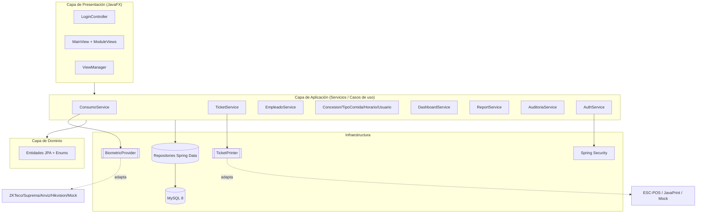
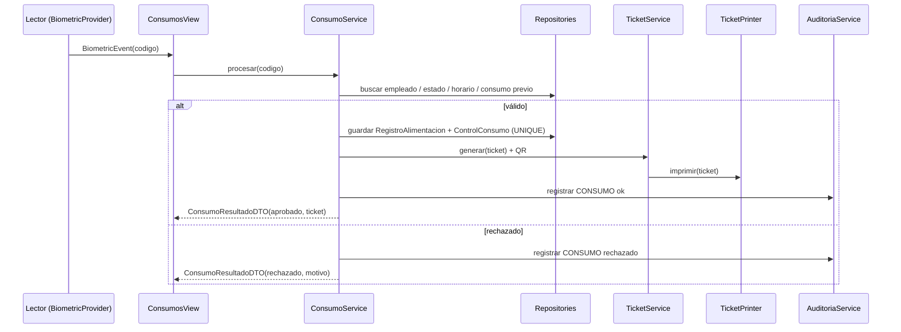

# Arquitectura — RegisterFoot

## 1. Visión general

Arquitectura **en capas** alineada con **Clean Architecture** y **SOLID**. La
regla de dependencia apunta hacia el dominio: la UI y la infraestructura
dependen de los servicios y del dominio, nunca al revés. El hardware
(biométrico, impresión) se aísla tras **interfaces** (DIP).

## 2. Capas y responsabilidades

| Capa | Paquete | Responsabilidad |
|------|---------|-----------------|
| Presentación | `ui`, `ui.controller`, `ui.view` | JavaFX, navegación, validación de entrada |
| Aplicación | `service` | Casos de uso, reglas de negocio, transacciones |
| Dominio | `domain.entity`, `domain.enums` | Modelo y reglas invariantes |
| Acceso a datos | `repository` | Repository Pattern (Spring Data JPA) |
| Infraestructura | `biometric`, `printing`, `security`, `config` | Adaptadores de hardware, seguridad, wiring |
| Transporte | `dto` | DTOs (records/JavaBeans) |

## 3. Principios SOLID aplicados

- **S** — Cada servicio tiene una única responsabilidad (Consumo, Ticket, Reporte…).
- **O** — Nuevos lectores/impresoras se agregan implementando una interfaz, sin
  modificar el flujo (`BiometricProviderFactory`, `PrintingConfig`).
- **L** — Todos los `BiometricProvider`/`TicketPrinter` son intercambiables.
- **I** — Interfaces pequeñas y cohesivas (`BiometricProvider`, `TicketPrinter`,
  `ModuleView`).
- **D** — La aplicación depende de abstracciones; las implementaciones concretas
  se inyectan por configuración.

## 4. Patrones de diseño

| Patrón | Dónde |
|--------|-------|
| Repository | `repository/*Repository` |
| DTO | `dto/*` |
| Factory | `BiometricProviderFactory`, `PrintingConfig`, `BiometricConfig` |
| Adapter | adaptadores de SDK en `biometric/`, backends en `printing/` |
| Template Method | `AbstractBiometricProvider`, `AbstractTicketPrinter` |
| Observer | `BiometricProvider.suscribir(BiometricListener)` |
| Strategy | selección de backend de impresión / proveedor biométrico |
| MVC | controllers/views JavaFX + servicios |

## 5. Flujo biométrico (secuencia)

## 6. Transaccionalidad y concurrencia

- El caso de uso de consumo es `@Transactional`; ante un duplicado se hace
  rollback (la fila `registros_alimentacion` no queda huérfana).
- La regla **1 consumo por tipo/día** se respalda con `UNIQUE(empleado, tipo,
  fecha)` en `control_consumo`: incluso en concurrencia, el segundo intento
  recibe `DataIntegrityViolationException` y se rechaza.
- La auditoría usa `REQUIRES_NEW`: persiste aunque el negocio haga rollback.

## 7. Seguridad

- Contraseñas con **BCrypt**.
- `AuthenticationManager` + `UserDetailsService` contra la tabla `usuarios`.
- Bloqueo por intentos fallidos (`max-login-attempts`).
- Autorización por rol en la UI (sidebar) y disponible por método
  (`@EnableMethodSecurity`).
