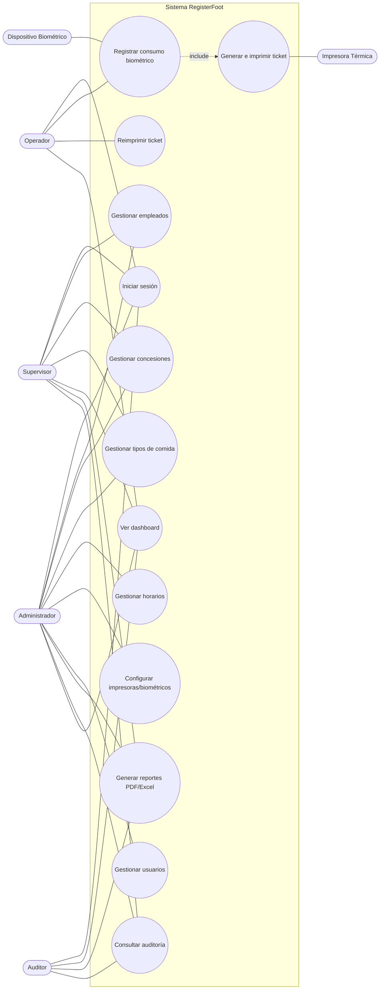

# Casos de uso (UML) — RegisterFoot

## 1. Diagrama de casos de uso

## 2. Caso de uso principal — Registrar consumo biométrico

| Campo | Detalle |
|-------|---------|
| **Actor primario** | Dispositivo biométrico (en nombre del Empleado) |
| **Actor secundario** | Impresora térmica |
| **Precondición** | Empleado registrado y activo; horario configurado |
| **Disparador** | El lector identifica una huella/rostro y emite un código |

**Flujo principal:**
1. El lector envía `codigo_biometrico`.
2. El sistema busca al empleado por su código.
3. Verifica que el empleado esté **ACTIVO**.
4. Determina el **horario vigente** según la hora actual → tipo de comida.
5. Verifica que **no haya alcanzado su límite diario** (según la categoría del
   empleado: NORMAL=1, ESPECIAL=2…).
6. Registra la transacción (`registros_alimentacion` + `control_consumo`).
7. Genera el ticket con número único y código QR.
8. Envía el ticket a la impresora automáticamente.
9. Registra la acción en auditoría.
10. Muestra confirmación en pantalla.

**Flujos alternativos / excepciones:**
- *2a.* Código no encontrado → rechazo `EMPLEADO_NO_ENCONTRADO`.
- *3a.* Empleado inactivo/suspendido → rechazo `EMPLEADO_INACTIVO`.
- *4a.* Fuera de cualquier ventana horaria → rechazo `FUERA_DE_HORARIO`.
- *5a.* Ya alcanzó su límite diario → rechazo `LIMITE_DIARIO_ALCANZADO`.
- *6a.* Colisión de secuencia por concurrencia → rollback + rechazo
  `LIMITE_DIARIO_ALCANZADO`.
- *8a.* Falla la impresora → el consumo queda registrado; se permite
  **reimprimir** (UC4) y se audita el error.

**Postcondición:** existe un registro de consumo, un ticket asociado y una
entrada de auditoría.

## 3. Caso de uso — Iniciar sesión

1. El usuario ingresa credenciales.
2. El sistema valida contra `usuarios` (BCrypt).
3. Si es correcto: crea sesión, actualiza último acceso, audita `LOGIN`.
4. Si falla: incrementa `intentos_fallidos`; al superar el máximo, bloquea.

## 4. Caso de uso — Reimprimir ticket

1. El operador busca el ticket por fecha y lo selecciona.
2. Solicita reimpresión.
3. El sistema incrementa `reimpresiones`, marca la reimpresión en el ticket y lo
   reenvía a la impresora.
4. Se audita `REIMPRIMIR`.
