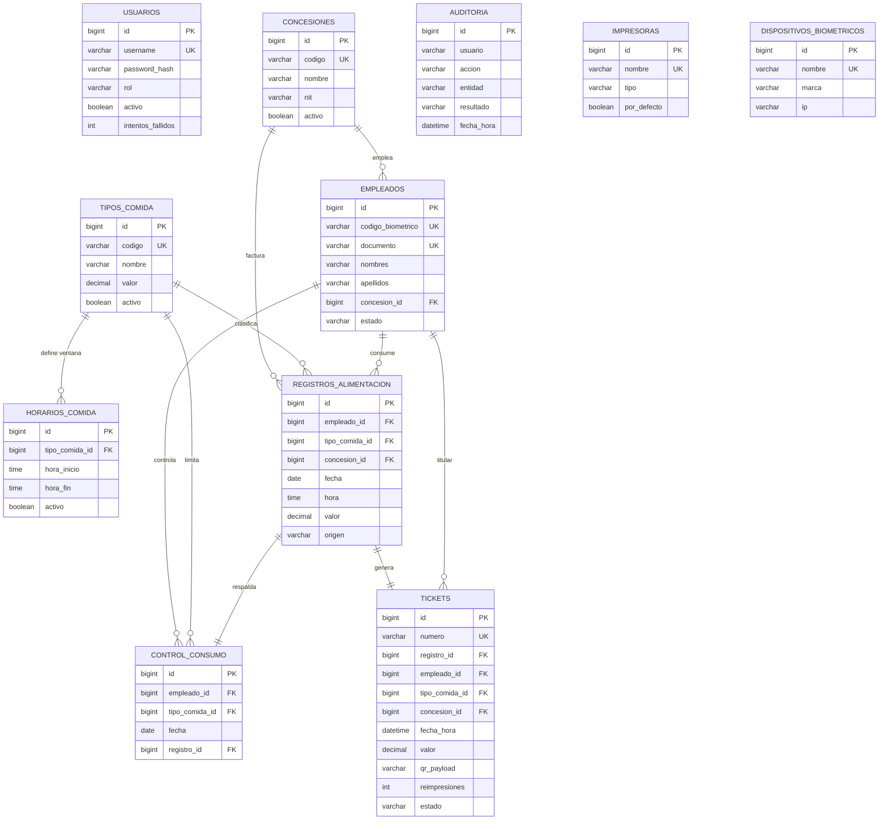

# Diagrama Entidad-Relación — RegisterFoot

## Restricciones clave

- **`control_consumo`** tiene `UNIQUE (empleado_id, fecha, secuencia)` →
  garantiza el **límite de consumos por día** según la categoría del empleado
  (la `secuencia` 1..N hace atómico el tope ante concurrencia).
- **`categorias_personal.limite_diario`** define cuántas veces puede consumir un
  empleado por día (NORMAL=1, ESPECIAL=2…); `empleados.categoria_id` lo asigna.
- **`tickets.numero`** es único e imprimible (formato `RF-yyyyMMddHHmmss-NNNN`).
- **`empleados.codigo_biometrico`** y **`empleados.documento`** son únicos.
- Borrado **lógico** (campos `activo`/`estado`) para preservar integridad
  referencial e historia.

## Tablas

Base obligatoria: `concesiones`, `tipos_comida`, `empleados`,
`registros_alimentacion`.
Agregadas: `usuarios`, `horarios_comida`, `control_consumo`, `tickets`,
`auditoria`, `impresoras`, `dispositivos_biometricos`.

Script completo en `src/main/resources/db/schema.sql`.
